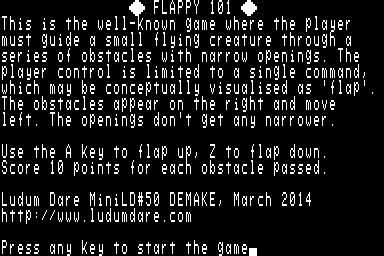
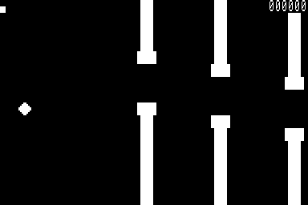
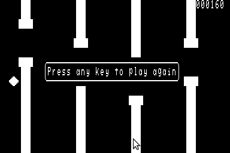

# Flappy 101

A simple game for the Compukit UK101. Written for Ludum Dare
Mini-LD number 50: DEMAKE.

## Implementation

The main loop of the game runs in BASIC, but the BASIC program
calls a machine-code subroutine via the USR() function.
The machine-code part of the game handles the movement of the
obstacles across the UK101's screen.

## Screenshots

